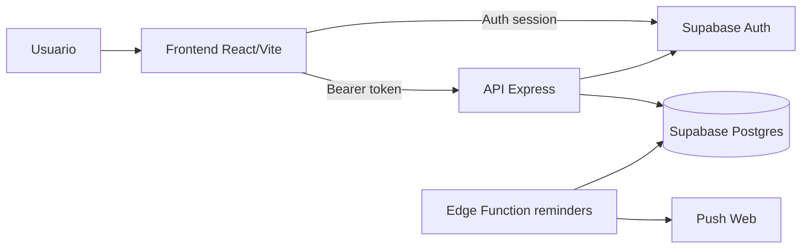
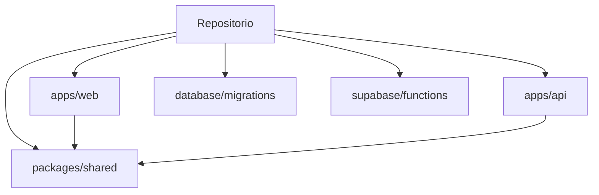
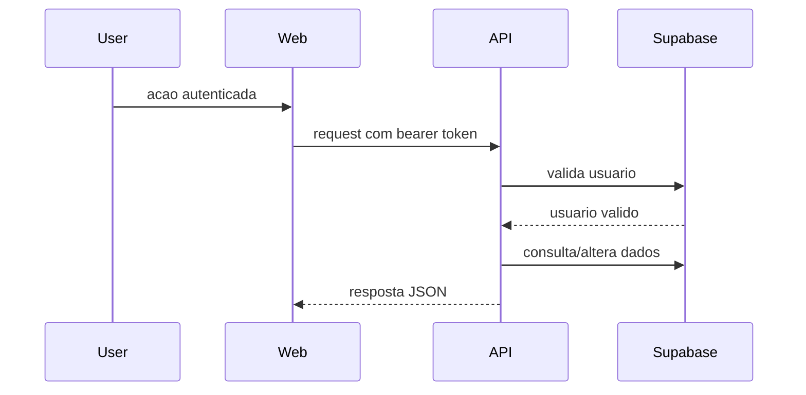

# Diagramas

Status: IMPLEMENTADA

## Visao geral

```mermaid
flowchart LR
  U[Usuario] --> W[Frontend React/Vite]
  W -->|Bearer token| A[API Express]
  W -->|Auth session| S[Supabase Auth]
  A --> S
  A --> DB[(Supabase Postgres)]
  EF[Edge Function reminders] --> DB
  EF --> P[Push Web]
```

## Pacotes do monorepo

```mermaid
flowchart TB
  Root[Repositorio]
  Root --> Web[apps/web]
  Root --> Api[apps/api]
  Root --> Shared[packages/shared]
  Root --> Db[database/migrations]
  Root --> Supabase[supabase/functions]
  Web --> Shared
  Api --> Shared
```

## Fluxo de requisicao protegida

```mermaid
sequenceDiagram
  participant User
  participant Web
  participant API
  participant Supabase
  User->>Web: acao autenticada
  Web->>API: request com bearer token
  API->>Supabase: valida usuario
  Supabase-->>API: usuario valido
  API->>Supabase: consulta/altera dados
  API-->>Web: resposta JSON
```
