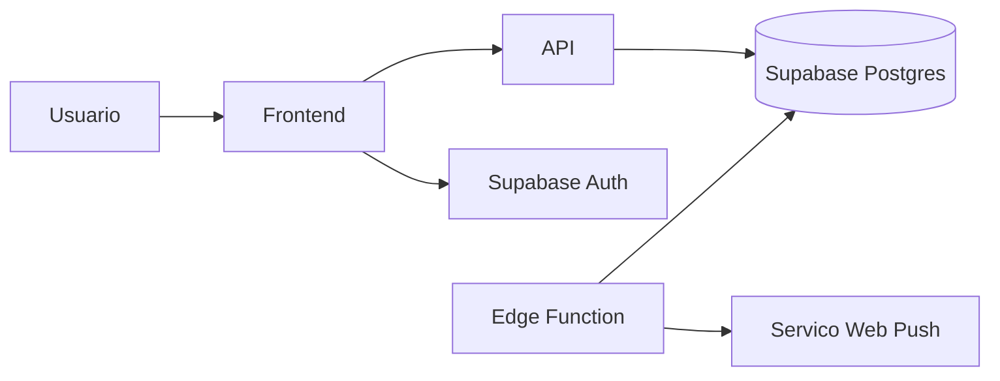

# Fluxo de dados pessoais

Status: PARCIALMENTE IMPLEMENTADA

## Pontos de processamento

| Ponto | Status | Dados |
| --- | --- | --- |
| Frontend | IMPLEMENTADA | Sessao, formularios, calendario e financeiro. |
| API | IMPLEMENTADA | Validacao e persistencia. |
| Supabase Auth | IMPLEMENTADA | Credenciais e sessao. |
| Supabase Postgres | IMPLEMENTADA | Dados de dominio. |
| Edge Function | PARCIALMENTE IMPLEMENTADA | Lembretes e inscricoes push. |
| Render | IMPLEMENTADA | Execucao da API. |

## Pendencia

Formalizar subprocessadores, regiao de dados, retencao e canal de solicitacao do titular.
