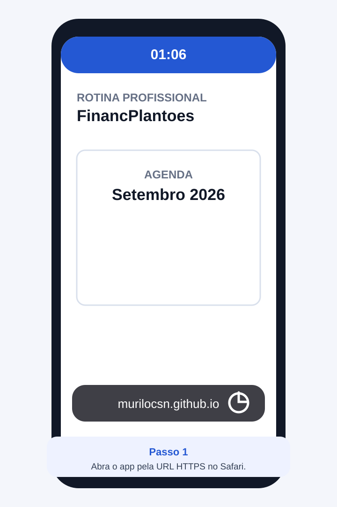
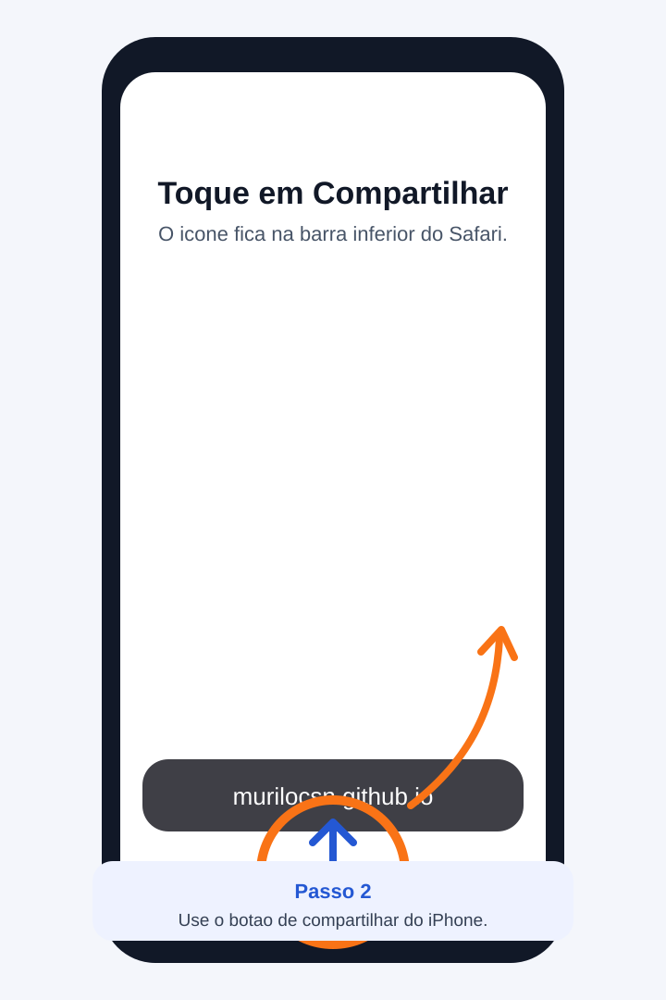
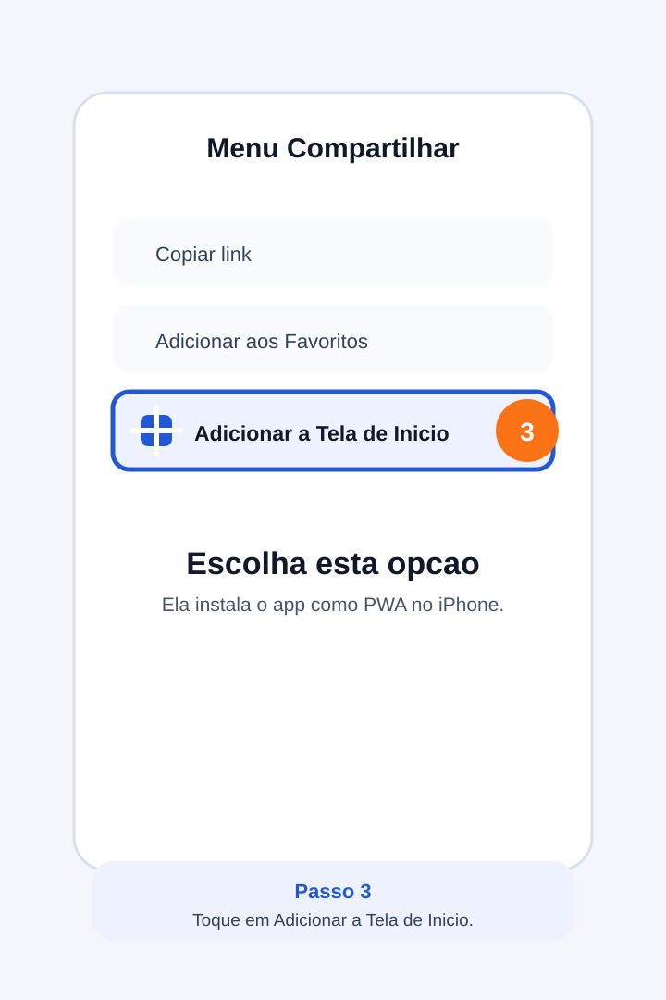
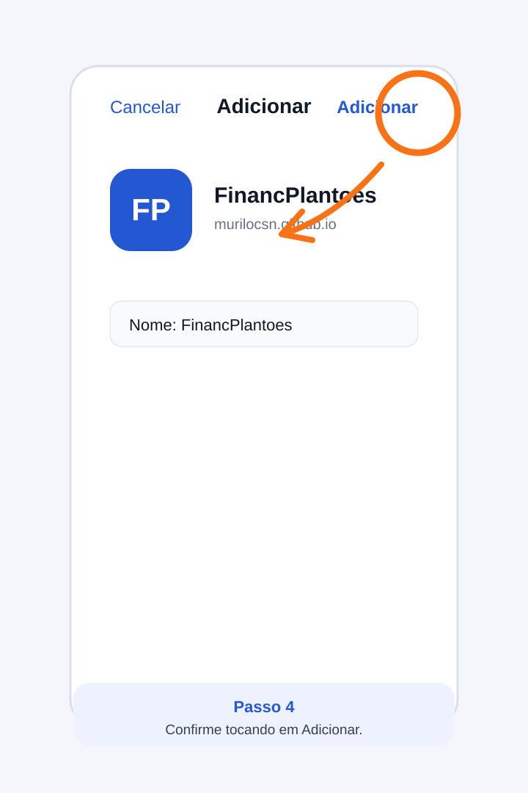
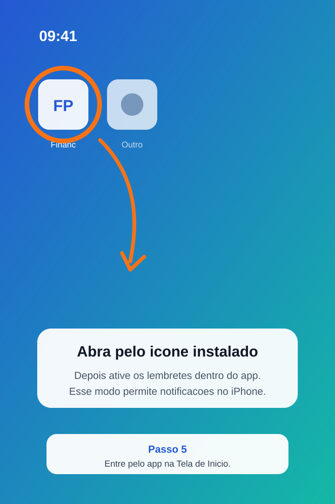

# Instalar na Tela de Inicio do iPhone

Status: IMPLEMENTADA

Este passo a passo mostra como instalar o FinancPlantoes como app na Tela de Inicio do iPhone ou iPad.

Esse modo e importante porque, no iPhone/iPad, as notificacoes push podem nao funcionar quando o sistema e aberto apenas em uma aba comum do Safari. Para receber lembretes, abra o app pelo icone instalado.

## Antes de comecar

- Use Safari em navegacao normal, nao privada.
- Acesse a URL publicada em HTTPS.
- Mantenha a mesma URL usada no app publicado.

## Passo 1 - Abrir o app no Safari

Abra a URL do FinancPlantoes no Safari.

## Passo 2 - Tocar em Compartilhar

Na barra inferior do Safari, toque no botao de compartilhar.

## Passo 3 - Adicionar a Tela de Inicio

No menu de compartilhamento, procure e toque em `Adicionar a Tela de Inicio`.

## Passo 4 - Confirmar

Confira o nome do app e toque em `Adicionar`.

## Passo 5 - Abrir pelo icone instalado

Volte para a Tela de Inicio e abra o FinancPlantoes pelo novo icone.

## Depois de instalar

1. Faca login pelo app instalado.
2. Toque em `Ativar lembretes`.
3. Permita notificacoes quando o iPhone perguntar.
4. Toque em `Enviar teste` para confirmar que o aparelho recebe avisos.

## Se nao aparecer a opcao

| Problema | O que fazer |
| --- | --- |
| Nao aparece `Adicionar a Tela de Inicio` | Confirme que voce esta no Safari, nao em navegador interno de outro app. |
| O app abre mas nao notifica | Abra pelo icone instalado, ative lembretes novamente e permita notificacoes. |
| Continua dizendo que nao suporta | Atualize o iOS e confira se esta usando o app instalado na Tela de Inicio. |
| Desloga ao abrir | Faca login novamente pelo app instalado; a sessao do Safari e do PWA pode ser separada. |
